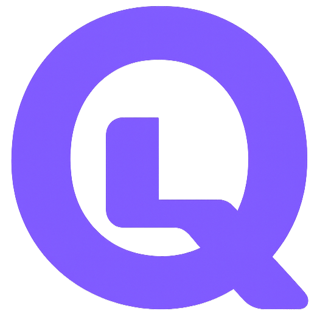
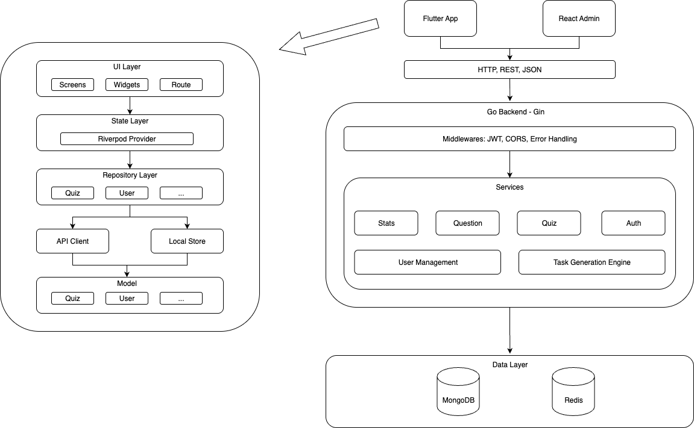
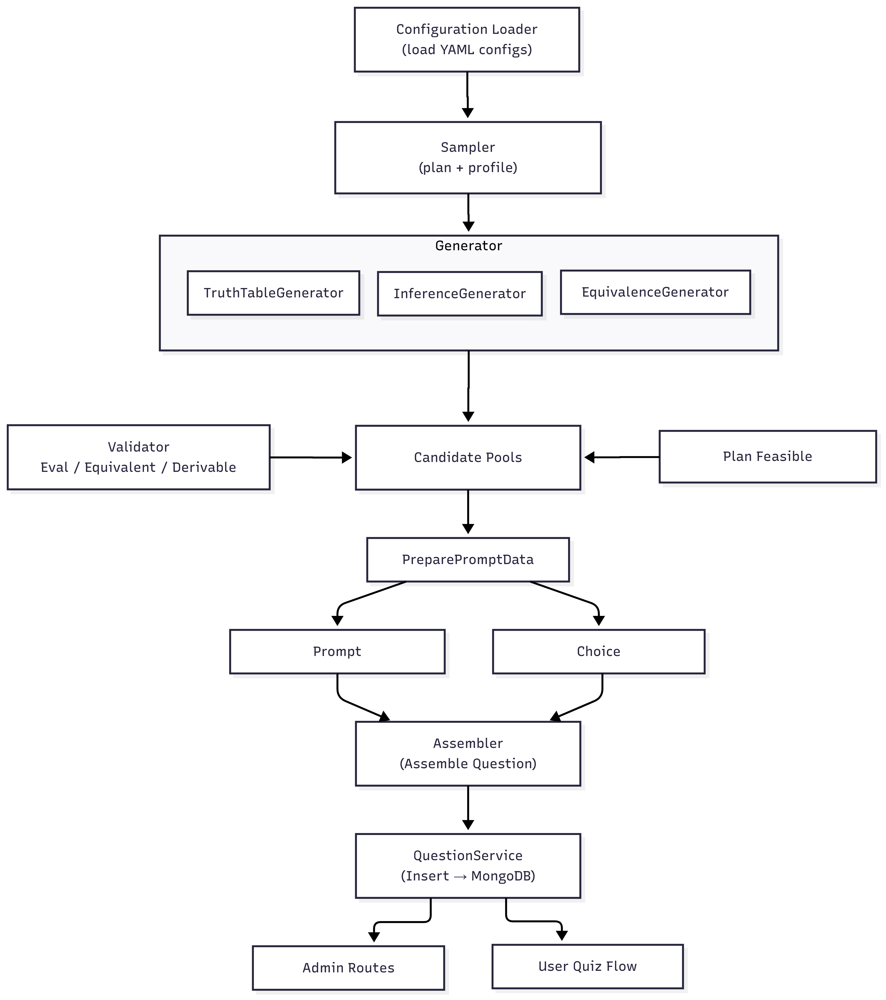
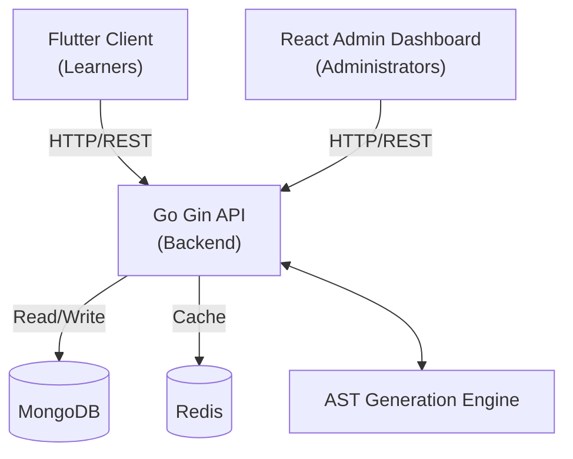

<div align="center">
  
  <h1>LogiQ | Formal Logic Quiz System</h1>
  <p><strong>A configuration-driven, multi-stage logic question generation and assessment platform.</strong></p>

  <p>
    
    
    
    
    
  </p>
</div>

<br/>

## 📖 Overview

**LogiQ** is a modern, full-stack platform designed for intelligent logic quiz generation and learning. At its core, it features a sophisticated, configuration-driven generation engine that builds formal logic questions based on Abstract Syntax Tree (AST) representations. Systematic validation ensures **100% logical consistency** for every generated question.

The platform includes a cross-platform client for learners, a powerful backend service, and a web-based admin console for comprehensive management.

## ✨ Key Features

* 🧠 **AST-Based Question Generation Engine**: A configuration-driven, multi-stage pipeline based on AST representations. Employs systematic validation (truth tables, equivalence checking) to guarantee 100% logical consistency.
* 📱 **Cross-Platform Learner Client**: Built with **Flutter**, offering a unified and consistent user interface across iOS, Android, and Web platforms.
* 💻 **Administrative Dashboard**: A modern **React + Vite** web application providing administrators with tools to manage the question bank, trigger generation pipelines, and monitor user statistics.
* 🔌 **High-Performance RESTful API**: Built with **Go and Gin framework**, utilizing **MongoDB** for robust persistence and **Redis** for high-speed caching. Achieved **89% unit and API test coverage**.
* 🚀 **Automated CI/CD Pipeline**: Streamlined workflows using **GitHub Actions** to automate Docker image builds, tests, and pushes to container registries (GHCR / AWS ECR), enabling version-controlled, reproducible deployments.

## 📸 Screenshots

<div align="center">
  
  
  
</div>
<br/>
<div align="center">
  
</div>

## 🏗️ System Architecture

LogiQ utilizes a decoupled architecture communicating over RESTful APIs.

<div align="center">
  
</div>

### Multi-Stage Generation Algorithm

<div align="center">
  
</div>

### Component Interaction Diagram



*(Additional diagrams available in the `report/latex/img/` directory: [ER Diagram](report/latex/img/ER-diagram.png), [Task Generation Flow](report/latex/img/Task-Generation-Flow.png), [User Management Flow](report/latex/img/User-Management-flow.png))*

## 📁 Project Structure

```text
LogiQ/
├── logiQ/
│   ├── backend/        # Go (Gin) REST API & AST Generation Engine
│   ├── frontend/       # Flutter mobile/web application for learners
│   ├── admin_site/     # React + Vite web dashboard for administrators
│   └── docker/         # Docker Compose configuration for local setup
├── .github/workflows/  # CI/CD pipelines (GitHub Actions)
└── report/             # Project specification, presentation, and LaTeX reports
```

## 🚀 Getting Started

### Prerequisites
- [Docker & Docker Compose](https://www.docker.com/)
- [Go 1.21+](https://golang.org/) (for local backend development)
- [Node.js 18+](https://nodejs.org/) (for admin site)
- [Flutter SDK](https://flutter.dev/docs/get-started/install) (for learner client)

### 1. Launch the Backend Services (Docker)

1. Navigate to the backend directory and set up environment variables:
   ```bash
   cd logiQ/backend
   cp .env.example .env
   ```
2. Adjust `.env` as needed (e.g., `MONGO_URI=mongodb://mongodb:27017`, `REDIS_ADDR=redis:6379`).
3. Start all services using Docker Compose from the project root:
   ```bash
   cd ../..
   docker-compose -f logiQ/docker/docker-compose.yml up --build -d
   ```
   *The Go backend, MongoDB, and Redis will start automatically.*

### 2. Launch the Admin Console (React)

```bash
cd logiQ/admin_site
npm install
npm run dev
```
*The admin console will be available at [http://localhost:5173](http://localhost:5173).*

### 3. Launch the Learner Client (Flutter)

```bash
cd logiQ/frontend
flutter pub get
flutter run
```
*Select your target device (iOS Simulator, Android Emulator, or Chrome).*

## 🛠️ Testing & Quality Assurance

The backend includes a comprehensive suite of unit and API tests, achieving **89% code coverage**.

To run tests locally:
```bash
cd logiQ/backend
go test ./... -v -cover
```

## 📦 CI/CD & Deployment

This project uses **GitHub Actions** for continuous integration and continuous deployment. 
- On every push to the `main` branch, the pipeline automatically runs tests, builds the Docker image for the backend, and pushes it to the container registry.
- Ensures version-controlled, reproducible deployments suitable for cloud platforms like AWS ECS/ECR.

See `.github/workflows/main.yml` and `logiQ/.github/workflows/ci.yml` for configuration details.

---
*Developed as part of the Logic App Development Coursework (May 2025 – Oct 2025).*